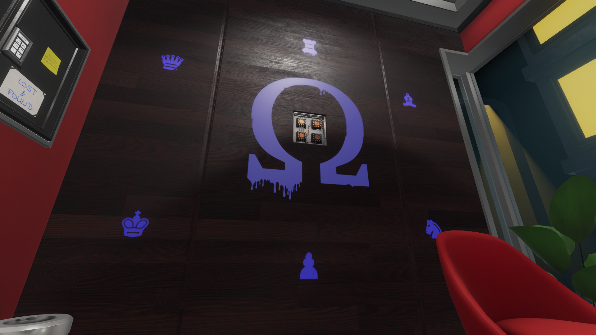
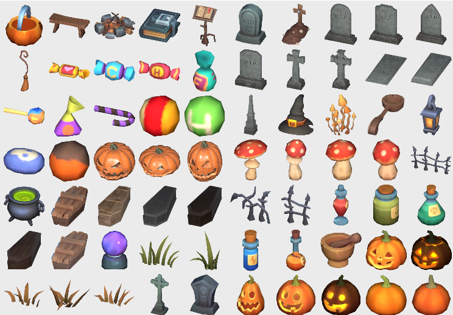
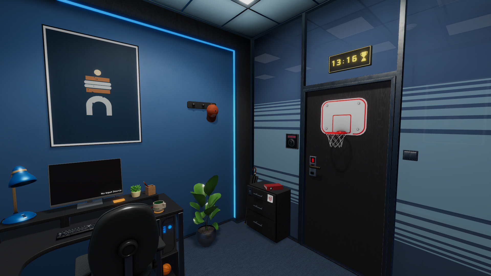
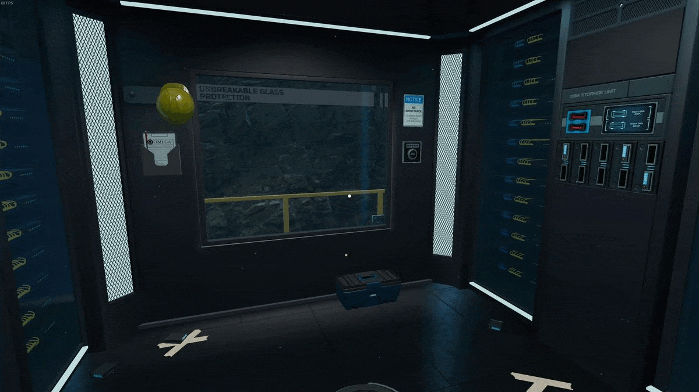

## New Official Room: The Lobby

We're releasing the first room in the all-new "Omega Corporation" pack, which will join "Labyrinth of Egypt", "Adrift in Space" and "Edgewood Mansion" as the 4th room pack. And best of all, you get to play it for free! The rest of the rooms from the packs are going to come in the coming two months.
<!--truncate-->

## Spooky season calls for spooky assets!

We're adding Halloween assets to the room editor. Enjoy the pumpkins and candy! :)

We've also added effects. You can now have things such as smoke, fire, and sparks in your rooms. Special logic fog component was also added so you can turn your environment spookiness to 11!

You can also see the video overview by our designated room designer Matija:
<iframe width="100%" height="500" src="https://www.youtube.com/embed/wk1Z_AxdTUw" title="Escape Simulator - Halloween Room Editor Update" frameborder="0" allow="accelerometer; autoplay; clipboard-write; encrypted-media; gyroscope; picture-in-picture; web-share" allowfullscreen></iframe>

## A Spooky room to go with spooky assets!

To test the assets, we've designed a spooky room. It requires 2+ players, and you can get it here:

https://steamcommunity.com/sharedfiles/filedetails/?id=2638379672

## Full changelog (1.0.8618)

<h4>Game</h4>

-  Added Omega Corporation room #1.
-  Custom rooms with textures on linux fixed!
-  Trash sticky fix
-  Net zoom fix
-  Trashcan name
-  Bug fixed where impostor is created on other player when one player takes item from the trash
-  Fixing s3 keypad desync and mp zooms
-  Fixed slot key scaling.
-  Fixing net buffer errors when sending syncRigidbody, optimize net messages
-  Space3 - storage room item positioning fixes
-  Audio Egypt1 & Egypt2 removed some audio which caused errors
-  Audio / removed sounds from hanging plants and chandeliers because of errors
-  Egypt4 - pyramid slot added
-  Trashcan duplication on zoom fixed
-  Egypt2 - scarab puzzle mp other player couldn't continue dragging fixed
-  Collection item stays selected on throw and drop.
-  Better networking, fixed some reconnection issues.
-  Victorian1 - large vase broke into extra pieces fix

<h4>Room Editor</h4>

-  Added effects
-  Added Fog
-  Added Crumpled Paper and texture
-  Created new portal and placed old portal in obsolete props
-  Created icons and generated meta
-  Different footstep sound in custom levels
-  Fixed Stove colliders, added Effects to the IgnoreTrigger Layer, and fixed effect colliders, Created new icons
-  Fixed Toy closet colliders and V2Desk Colliders.
-  Clean outline on room reset.
-  Desk compound fix.
-  Halloween props, scripts, colliders and icons. 
-  Added nav mesh obstacles to all props that were to big to move through. Added switches to chest-s and props that needed to be openable by default.
-  Different ghost material.
-  Trigger fixes.
-  End screen does not teleport players in custom rooms, a bit different end screen
-  Added new textures for basic shapes, fixed collider issues on v2desk, new Halloween prop icons. 
-  Triggers can be triggered by switches (with rigidbodies)
-  Halloween walls
-  Vector3 property z fix.
-  Disable setting slot as a parent.
-  Set Lock prefab collider to isTrigger.
-  Autosave.
-  Card material editor fixes.
-  Teleport all players.
-  Remove temp publish rooms on init
-  Fixing duplicate workshop items
-  Fixing sorting & editor rooms token UI removed
-  Sorting workshop rooms
-  Map editor fixing tags. Decor, carpets etc.

# 🚀 100 000 players! 🚀

Over the weekend, we passed the number **100 000 players**! That's beyond awesome, and what better way to celebrate than by releasing a new room for you all to play! 😊

## New Official Room: The Office

It's time for the 2nd room in the Ω Corporation pack: The Office!* You're trapped in the office of an employee of secretive Ω Corporation, he had to be very **very** careful when he left you clues how to escape and get to the next room.

* Right now, it's launching only in English. More languages for the whole Omega Corporation pack are coming next week.

## Changelog v1.0.18958r

<h4>Features</h4>

- Omega Corporation room #2 released!
- RoomEditor: Dial, turnable - edit multiple.
- RoomEditor: searching improvement, consider tags.

<h4>Fixes</h4>

- Fixed hint tint colors.
- Rigidbody child object now animates directly, bypassing issues with physics. (Unity issue)
- Room editor: removed normal map from medieval material, changed the size of medieval walls - Walls and props. 
- RoomEditor: deleting multiple objects fix.
- Better logging for networking.
- Join lobby if localPlayer disconnected
- Download workshop item on play.
- Not simulating physics until all players join.
- Better syncing off rigidbodies that are important.
- Removing scale in sending rigidbody data.
- Networking now syncs buttons directly, without going through physics sync.

# OMEGA ROOMS

Hello explorers! 
We have something special for you today. Omega Update is now LIVE! This is our biggest free update so far, and it brings a lot of new content. 

Also, it's a great time to get Escape Simulator (for yourself or as a gift ;)) because the game is **20% off** this weekend! 
https://store.steampowered.com/app/1435790/Escape_Simulator/
Thanks to all our **beta testers** and guys from our [Discord](https://discord.gg/pinestudio) channel for the support! ♥

Enjoy the update!

<h4>Game</h4>

-  **3 new rooms** that complete Omega Corp. theme
-  **French** language
-  **German** language 
-  Full **gamepad** support
-  You can now add **custom sounds** to your workshop rooms 
-  New co-op hosting mode that should **fix the connection problem** that some of you have 
-  A lot of minor bug fixes

