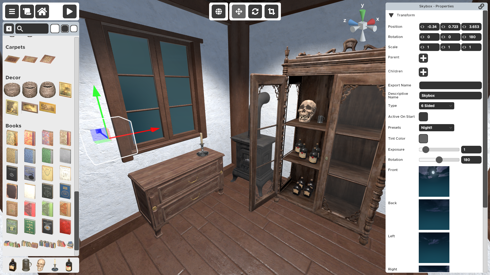

# The Alchemist has arrived! 🧙

Earlier this month, we asked our community to vote between four potential asset packages for the room editor. Out of these packages, The Alchemist package got the most votes by far. So now it's time for all of you to work your magic!

<!--truncate-->

# Additional Room Editor updates

### New assets:
- Skyboxes
- New effects

### New logic items:
- Open link: Players can open links to Steam, Steam Community, or Wikipedia URLs.
- And/Or/XOR /Not gates on the Lock object
- Activator that can enable or disable objects

### Features:
- Button, Animation, Lock, Trigger, and Slot have new Output Value field that can be changed
- Code optimizations

# But wait, there's more!

Finally, the latest update also includes:

<h4>Changelog</h4>

- Steam Deck support
- Internal rework of networking - it should work much better for the community rooms now!
- Linux and Mac graphical fixes
- Daily Picks rework
- Added additional custom level packs
- 388 commits of tweaks and fixes

# Hotfix #1

<h4>Changelog</h4>

- Fixed missing assets in the existing community rooms (egyptian walls, boots)
- Halloween props can now be painted
- Trashcan issues fixed
- Removed tokens from props
- Fixed item rotations and names

# Hotfix #2

<h4>Changelog</h4>

- Fixed freeze when some items enter trashcans

