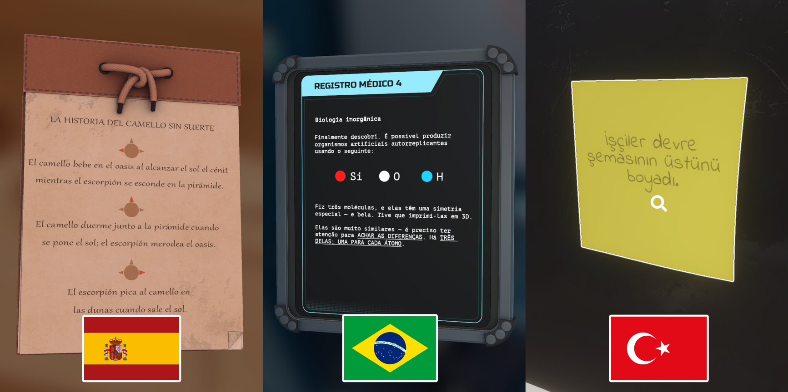

# Merhaba! / ¡Hola! / Olá!
The time has come for another big Escape Simulator update! Today we will be adding no less than **five** language options to the game. Once this update goes live, you will be able to play the entire game in Türk (Turkish), Español (Spanish), Español (Spanish Latin America), Português (Portuguese) and Português (Portuguese Brasil)! We know that a lot of you have been waiting very patiently for this specific update, so we are very glad to reveal that the wait is finally over!

<!--truncate-->

# New publishing options 📝
Additionally, we have completely reworked the 'Publish custom room screen'. This update includes several new options you can adjust when publishing your custom room to Steam Workshop. First off, you can now change the visibility settings of your room before publishing. This also allows you to publish your room directly from the Room Editor. Furthermore, you will be able to change the description of your room and add new Patch Notes. Lastly, this update also enables the option to add Steam Workshop tags to your room, which should make it much easier for other players to find exactly what they are looking for. 👀

# Additional updates and tweaks (v1.0.20730r)

<h4>Changelog</h4>

-  New trigger option: Trigger when all players enter the trigger
-  New lock option: Added parity XOR and exclusive XOR
-  New hair options for Cori's dad 🙂
-  New languages
-  Game optimizations, should run more smoothly and take less memory
-  Loop animations soft-lock in custom rooms fixed
-  UX tweaks for controller and general feel of the game so it is more uniform

