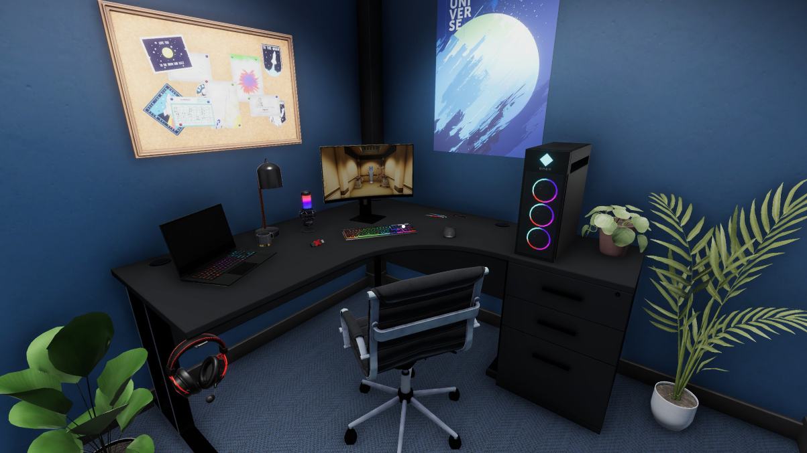

**CALLING ALL ROOM BUILDERS!**
Starting today, Escape Simulator will be collaborating with **HyperX** and OMEN for a VERY special room building challenge! The winners of this challenge will be rewarded with a variety of products provided by both brands. See the full list of prizes below! 

To get a chance of winning these awesome prizes you will need to build the **ultimate gaming escape room** with Escape Simulator’s in-game room editor! In order to build this ’Ultimate Game Room’, you will need to make use of a full set of assets that represent real-life HyperX and OMEN products. You can find these assets in the Room Editor. Submissions will be considered if they have been sent in before April 11, 2022 (6PM CEST / 9AM PT / 12PM ET)

We aim to announce the winners on **Monday, April 25**! As we want to play every room thoroughly, depending on the amount of submissions the picking of winners might take longer than expected. We will communicate this in a timely manner if this happens!

## 🏆** Prizes* **
-  **First Place:** OMEN 16 laptop + HyperX peripheral range including Cloud Alpha Wireless headset, QuadCast S microphone, Alloy Origins 60 keyboard, Pulsefire Haste Wireless Black mouse, Pulsefire Mat RGB mousepad
-  **Second Place:** Cloud Alpha Wireless headset
-  **Third Place:** QuadCast S microphone
-  **Fourth Place:** Alloy Origins 60 keyboard
-  **Fifth Place:** Pulsefire Haste Wireless White
-  **Sixth Place:** Pulsefire Haste Wireless Black
-  **Seventh, Eighth, Ninth, and Tenth Place:** Pulsefire Mat RGB 
-  **Community Choice:** Cloud Alpha Wireless headset + Pulsefire Haste Wireless Black mouse + Pulsefire Mat RGB mousepad

*Prizes are subject to change depending on availability at HyperX and OMEN.

## 📑 **Rules**
-  Create a game room using (at least one) provided HyperX and OMEN asset.
-  To submit a room for the competition, you have to post a link to your room in the "#🏆challenges" channel in the [Pine Studio Discord](https://discord.com/invite/ss2ycVXpjT), or in [this Steam forum thread](https://steamcommunity.com/app/1435790/discussions/0/3272436223672916055/). 
-  You can only submit** one** room. Multiple submissions will not be counted.
-  You are allowed to bug fix your room after submission, but not resubmit an entirely different room.
-  Copies of other players' rooms are not eligible.
-  Keep it fun/clean! No profanity, racism, hate speech, sexually suggestive, etc content. Rooms that might be considered offensive in any way or form will be disqualified.
## ⚖️ **Judging Criteria**
Rooms will be judged based on criteria such as the quality of the puzzles, level of innovation, visual appeal and more. See the [full list of criteria (and points system) here](https://forms.gle/ayZ5GXvSreGrykvs9)!

## ⚒️ **Tips & Tricks**
-  Go to Escape Simulator, "Workshop" button, "Your Rooms," and press "Create". This creates an empty room, and you can start building.
-  To get some help, you can look through "Tutorial Rooms" and learn the basics such as puzzles and animation.
-  Or you can watch [our tutorial video](https://www.youtube.com/watch?v=Y8p-C327wAw).
-  Need some more inspiration? Then you should definitely check out the winners from our first [‘Build-a-room’ challenge](https://store.steampowered.com/news/app/1435790/view/3087774682030958698)!
-  Finally, you can also [join our dedicated Discord community](https://discord.com/invite/ss2ycVXpjT) to ask about anything you might need help with!
## **🙋 How do I submit my entry?**
Submitting a room for the competition is very easy. Just post a link to your room in the "🏆challenges" channel in the [Pine Studio Discord](https://discord.com/invite/ss2ycVXpjT)!

## 🎥 **Join our livestream today!**
Today (March 29) we will have a special livestream with **live Q&A** so you can ask anything and everything about this competition or other Escape Simulator related questions! 
The stream starts at 8pm CEST/11am PDT/1pm CDT. Hope to see you there!

## Happy building!
We hope you are as excited about this competition as we are and we can’t wait to see all of your amazing creations! 

------------------------
Also, a **new small update** is out now! 

<h4>Changelog</h4>

-  New Gaming assets for room editor featuring HyperX and Omen products
-  Networking has more fail checks, which can result in error screens instead of game crashes
-  Co-op fix where you could stay zoomed in but the item disappears
-  Support for multiple controllers connecting and disconnecting
-  "Metaverse" co-op fixes
-  "Space Walk" translation fixes
-  Room editor duplicate room bug fix when changing languages
-  Room editor room renaming bug fix

# Hotfix #1

<h4>Changelog</h4>

-  Fixed crash with wrong format workshop rooms (stuck on menu screen with % signs)
-  Fixed download and unsubscribe buttons
-  Egypt - Room #2 - Chamber of the Dead - fixed Scarab puzzle in multiplayer

