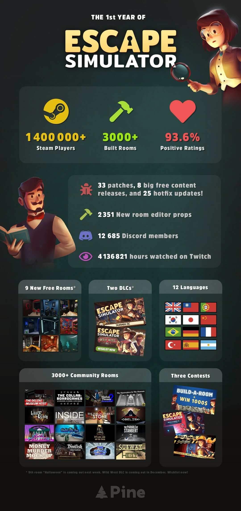
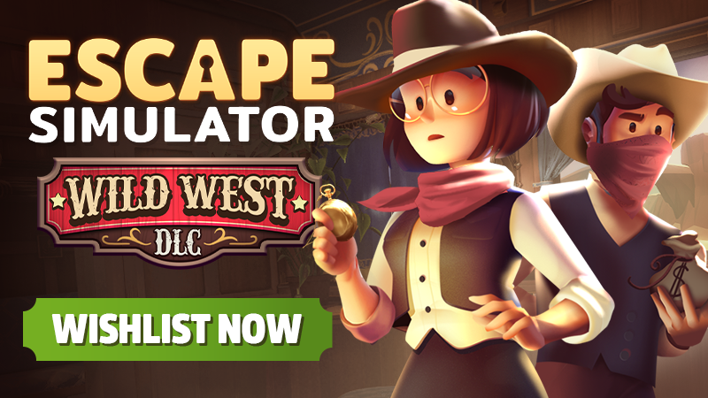

## Happy birthday to us! 🥳

Wow! Has it really been this long? Where _does_ the time go? We can hardly believe it ourselves, but it's definitely true. As of today, Escape Simulator has officially been **out for an entire year** already! And what a year it has been for all of us at Pine Studio! 

To celebrate the first anniversary of Escape Simulator, we're looking back at everything that has been achieved so far, while also giving you a sneak peek of what's yet to come. Join us for another dev update and feel free tell us your favorite memory of the game so far in the comment section down below! If you do so, and give this a announcement a like, you might win a key for our upcoming DLC (once it's out)!

_Update: The two lucky winners of the Wild West DLC are Lyalya and -Swervin-! You will be contacted by our community manager for the Steam keys!_

## The journey so far...

When Escape Simulator first released one year ago, the base game featured 15 rooms spread out across three different themes. So far, that number has been increased to 23 and we still have more free rooms planned! Five of these were part of the Omega Corporation update and of course we also added three extra rooms: Santa's Workshop, Cats In Time and the recently released 70's Room. Additionally, we released the [Steampunk DLC](https://store.steampowered.com/app/1942100/Escape_Simulator_Steampunk_DLC/) back in June and we just announced a [second DLC](https://store.steampowered.com/app/2175260/Escape_Simulator_Wild_West_DLC/) as well! More on that in a bit! 😉

Of course, Escape Simulator also owes a lot to its incredible community! That's why we want to give a massive shoutout to all of the builders who keep surprising both us and all other puzzle fans with awesome content. So far, there are already over **3000** published rooms to check out on the [Steam Workshop](https://steamcommunity.com/app/1435790/workshop/)! We also loved to see all of the excellent entries we received during the three different builder competitions that took place so far.

Of course our room editor has also gone through a lot of changes since the initial release. A whole bunch of new features have been added, with the [Room Editor 2.0](https://steamcommunity.com/games/1435790/announcements/detail/3367016884694436693) update being our biggest update to the editor so far. As you might recall, that update featured the addition of new lighting options, scripting with LUA, a model importer and many more quality of life tweaks. 

Finally, we are happy to say that Escape Simulator is now playable in a grand total of **twelve languages**, eleven of which have been added post-launch! We have also added gamepad support, so you can play the game however you want. We were astounded to the see game reach over ONE MILLION players and we hope you'll stick with us for even more escape fun! Now, are you ready for a sneak peek on the future of the game? 👀

## ...and what lies beyond! 🚀

So if you've been keeping an eye on this channel, you might already know that a second DLC is coming to Escape Simulator! Last week, we announced the [Wild West DLC](https://store.steampowered.com/app/2175260/Escape_Simulator_Wild_West_DLC/) which is set to release in December! If you haven't already, be sure to wishlist it to receive a notification as soon as it's available!

https://store.steampowered.com/app/2175260/Escape_Simulator_Wild_West_DLC/

Can't wait that long? No worries, we've got you covered! In order to celebrate the 👻 SPOOKY SEASON 👻, we are adding a free [Halloween room](https://store.steampowered.com/news/app/1435790/view/3274703239559936680) to the game next week! This update also comes with an additional outfit and a new music track to match the eerie vibes. We still have at least two more free rooms in development, so please continue to look forward to those as well!

Thanks again for all of the support you provided over the past twelve months! We couldn't have done it without all of you!

### ♥ Pine team
