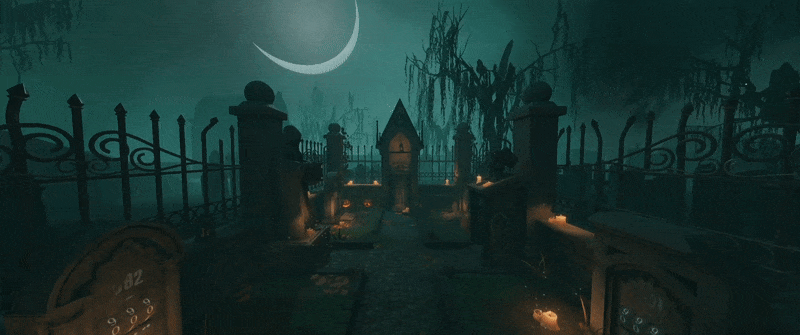

## Things are about to get spooky! 👻

We hope you're ready to solve some more tricky puzzles, because the Halloween update for Escape Simulator is **OUT NOW**! This update features a brand-new room set in an eerie looking graveyard. Will you be able to solve its many mysteries? 🔍

To really add to the spooky vibes, the new Graveyard level is accompanied by a special soundtrack! But wait, you didn't think we'd let you celebrate Halloween without a matching outfit, right? Of course not! That's why the Halloween update also features a new customization option that allows you to turn your character into a ghostly version of itself! 
We also did more than **600 fixes and quality-of-life improvements** for the game. You can read the whole changelog below.🔽

We hope you will all enjoy this free update to celebrate the month of Spooktober! In case you missed it, we recently announced the **next big DLC** for Escape Simulator as well. The [Wild West DLC](https://store.steampowered.com/app/2175260/Escape_Simulator_Wild_West_DLC/) is set to release in December, so make sure to wishlist it! This way, you'll receive a notification as soon as it's out. In the meantime, feel free to join us on our official [Discord](https://discord.gg/pinestudio) or [Reddit](https://www.reddit.com/r/PlayEscapeSimulator/) to talk about all things Escape Simulator. Hope to see you there!

##  Full changelog

<h4>New content</h4>

- Brand new haunted room: Graveyard.
- You have the option to be a ghost in multiplayer levels!

<h4>Rooms fixes</h4>

- 70's Room: Fixed polaroid flash.
- The Engine Room: Fixed using fire extinguisher with a controller.
- The Top: a rotating object should feel better in singleplayer and multiplayer.
- The Elevator: there is a reset button for the circular puzzle in case you get stuck.

<h4>Lua</h4>

- Better error handling, the log will show on what line the error occurred
- Added support for Slidables in Lua
- Lua fixed can't enter negative indexes for locks

<h4>Room Editor</h4>

- Introducing the all new prop behaviour ✨The Slidable✨ 
- Added button to fix workshop item id in the publish room menu
- Controller slot interaction should work better
- Pickables now work on zoomables
- Fixed crashing on copy/duplicate and undo
- Unlock input on locks should now work for continuous and fixed locks
- Fixed importing a display prop with textures breaks the room
- Only the display logic prop needs the transparent order offset checkmark
- Custom models material fixes
- Fixed laser effect rendering on screen
- Sounds shouldn't continue on loading next episode
- Fixed finish screen exit room buttons
- Keypad prop reset button fixed

<h4>Other features & fixes</h4>

- There is a new news section. It will display important updates to the game.
- Better controller handling.
- Better controller slot interaction.
- Voice chat is now much more reliable.
- Proximity chat is now working properly.
- Fixed a bug where removing an item from inventory could crash the game.
- Fixed placement of the held item on all camera FOVs.
- filtered chat messages are no longer just ignored
- Item can no longer be pinned during animation.
- There are avatars in UI showing who is speaking in voice chat.
- Sliders have been improved across the game. They should feel better in singleplayer and are synced better in multiplayer.
- **617 commits** of bug fixes and quality-of-life improvements!

