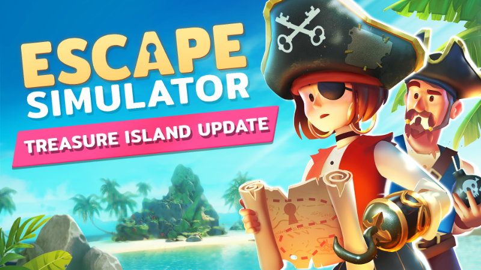
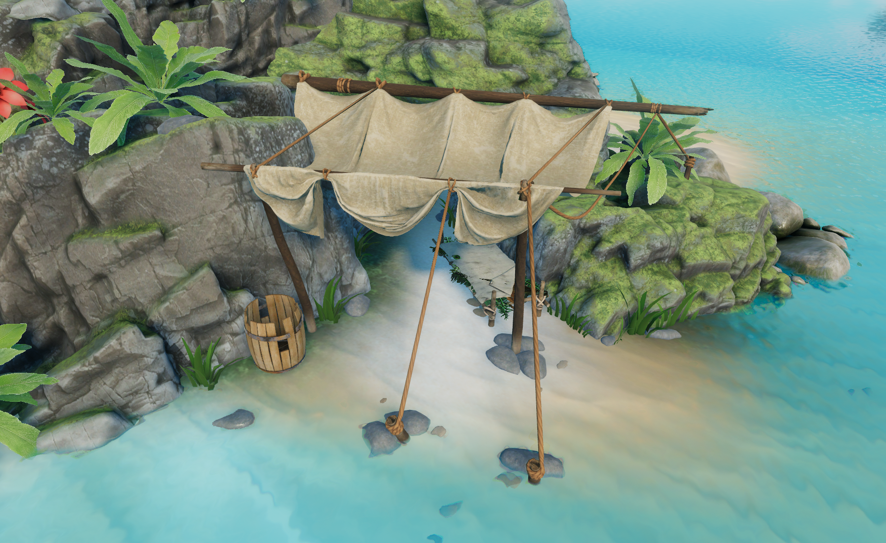

## X marks the spot! 🗺️

Ahoy there, scurvy dogs! Get ready for another swashbucklin’ adventure in Escape Simulator! Our latest free update sets sail to Treasure Island, where you can explore a vast island that’s rumored to hide an invaluable treasure. The Treasure Island update also comes with a matching outfit and an additional soundtrack to accompany you on your quest for booty! Alongside this exciting content, we've made a whole bunch of fixes and additions, which you can find in the full changelog below. So set sail and join the hunt for the hidden treasure!

<!--truncate-->

Visit the [Steam Store](https://store.steampowered.com/app/1435790/Escape_Simulator/) to check out the game!

To celebrate the launch of this new room, we are offering a 25% discount on Escape Simulator. It's the perfect time to get the game for yourself or gift it to a friend!

With this update, we unveil two secrets from our roadmap for 2023! Escape Simulator VR is coming soon, allowing you to experience all the base game rooms in virtual reality. You'll soon be able to explore Treasure Island up close! Help us by adding Escape Simulator VR to your [Steam wishlist](https://store.steampowered.com/app/2440240/Escape_Simulator_VR/) and stay tuned for more exciting announcements.

## Avast, ye landlubbers!

We hope you're all set to embark on this adventure to Treasure Island, and we can't wait to hear your thoughts on this brand-new room! Our roadmap for 2023 promises even more updates, so stay tuned for upcoming announcements. In the meantime, feel free to join our official [Discord](https://discord.com/invite/pinestudio) or [subreddit](https://www.reddit.com/r/PlayEscapeSimulator/) to be part of the Escape Simulator community. See you there, adventurers!

## Full changelog

<h4>New content</h4>

- Shiny new room: Treasure Island
- New character customization options for Treasure Island
- New Puzzle logic prop for the room editor

<h4>General fixes</h4>

- Saves are now in Json format.
- Fixed some RAM memory leaks.
- Reduced size of the game.
- Objects cannot enter two slots by throwing.
- More performant Mirrors.
- Mirrors work in zoom.
- CJK Fonts now work on Steam deck.
- Added zoom in hint on the controller when possible to zoom in.
- Internal rework of sliding puzzles for fewer errors.
- Fixed all small UI input offsets in levels.
- Added rounded corners where they were missing.
- Next Level now works across all extra rooms.
- Particles are now hidden in ghost placement objects.
- Changed the way items interact with the physics engine, resulting in more fluid collisions.

<h4>Co-op fixes</h4>

- Every puzzle now has a name.
- Every sent data packet is smaller, improving Co-op performance.
- Rework of syncing object poses, resulting in smoother gameplay in larger rooms.
- Fixing crashing when interacting with items with weird parenting in custom rooms.
- Items are now spawned into the host's inventory when a player disconnects.
- Items are now thrown from the hand, resulting in smoother animation.

<h4>Workshop & Room editor fixes</h4>

- Audio crashes with sound props fixed.
- Better handling of audio on large rooms.
- Zoomables now have free camera position.
- Walkthrough text cutting off and not saving fixed.
- Editor Tutorial rooms - fixed teleport buttons.
- Fixed Game freeze on dragging objects to slots.
- Locks don't need to trigger sound props with a 1.
- Open walkthrough with H for testing in the room editor.

<h4>Level specific fixes</h4>

- Fixed "The Top" bug where multiple people would "solve" slider puzzle.
- Far objects in "The Top" are now pingable in coop.
- Orange is more orange than ever in "Leonardo's Workshop".
- Fixed wrong syncing of balls in "Chamber of Danger".
- Better colliders in the clock of "The Underground Lab".
- Fixed keypad position in "The Lab".
- Fixed "Decompression Chamber" bug where the tool would fly in the air after using it.
- Reduced the number of net packets sent in "Space Walk", resulting in smoother gameplay.
- Better controller handling of rope puzzle on "The Engine Room".
- Fixed disk syncing in "The Engine Room".
- Better controller handling of the final puzzle on "The Helm".
- Better colliders in the sink of "The Saloon".
- As always, we've added more bugs to fix later.

