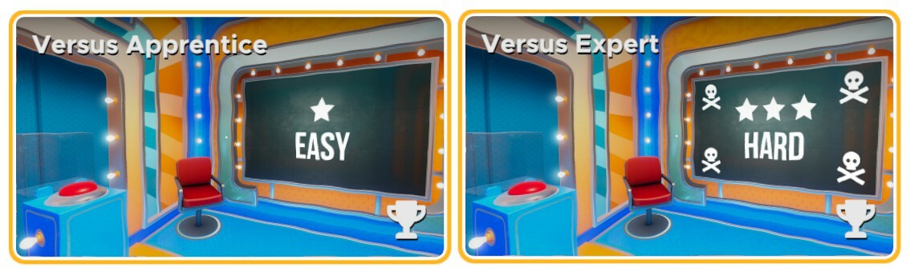

# Are you ready for a battle of the brains? 🧠

<iframe width="100%" height="500" src="https://www.youtube.com/embed/weeOjkY0Ais" title="Escape Simulator: Versus Update - Out now!" frameborder="0" allow="accelerometer; autoplay; clipboard-write; encrypted-media; gyroscope; picture-in-picture; web-share" allowfullscreen></iframe>

Always wondered if you were the one with the biggest brain among your friends? Today you'll be able to find out for yourself by challenging them in Escape Simulator's brand-new Versus Update! Rise to the top of the ranks by being the first to solve all the puzzles in one of our many escape rooms. To commemorate this new way to play, we are also adding a truly challenging room that takes place on a quiz show from the 80s.

Finally, we would like to challenge all of our community's incredibly talented room builders to create their own Versus rooms! That's right, **we are kicking off our fourth official Build-A-Room challenge TODAY**! As always, there are some awesome prizes involved. Be sure to keep reading for more information on this new Build-A-Room challenge down below!

The Versus Update is absolutely huge and it features a new game mode, new rooms, soundtrack, outfits, a few very interesting additions (such as "join random multiplayer lobby" option), and a bunch of fixes. The full massive **changelog is in the bottom of the page**.

## But how does it work?

As the title implies, in this brand-new Versus Mode, you will be able to take on other players to prove that you are the greatest escape artist. Just like in the regular Co-op Mode, one player will need to host a game to create a lobby for your opponents to join. Once that's settled, you’ll have to select a room that each of you will be tackling individually. You can choose any room you want, even the community rooms made in the in-game room editor!

Once you've selected and entered a room, the game begins. In order to keep track of how far along your opponents are, we've added an in-game progress bar that shows you exactly whether you're ahead of the game or if you should step it up a notch! This progress bar will allow you to see the exact progress of your opponents. No pressure or anything.

## Back to the 80s! ✨

In addition to the new game mode, we are also adding another free room with two different difficulties (the hard one is designed in collaboration with Wollo!) as part of this update! This time, you will find yourself on the set of a classic game show from the 80's. This room was specifically made with Versus Mode in mind, so you can definitely expect a truly challenging room this time around! Finally, we are also adding a brand-new outfit that will come in two different colors; red and blue! Will your team come out on top and steal the show? Only time will tell!

# Build-A-Room #4: Versus Challenge!

As mentioned earlier on in this announcement, the next Build-A-Room contest kicks off **RIGHT NOW**! The only condition for this contest? Create your own Versus Room that is explicitly made to have players race against each other. But what can you win? Well, we're glad you asked!

## Prizes:
- The first place winner will earn themselves **$2,000 in cash** + an escape room board game by *PostCurious*!
- The second and third place winners get **$100 Steam gift card** + an escape room board game by *PostCurious*
- Winner #4-10 get a **$100 Steam gift card**!

## Rules:
- To submit a room for the competition, post a link to your room in the "#🏆challenges" channel in the [Pine Studio Discord](https://discord.gg/pinestudio), or you can send a submission via this [Steam thread](https://steamcommunity.com/workshop/discussions/18446744073709551615/3806156352192959151/?appid=1435790).
- You can only submit one room. Multiple submissions will not be counted.
- Multiple builders can work together on one room together but there will be only one prize for them.
- It has to be a room escape.
- The gameplay should ideally be under 30 minutes, but it could be longer.
- You can make the room as big as you wish.
- You need to record a video walkthrough.
- You are allowed to bug fix your room after submission, but not resubmit an entirely different room.
- Copies of other players' rooms are not eligible.
- Keep it fun/clean! No profanity, racism, hate speech, sexually suggestive, etc. content. Rooms that might be considered offensive in any way or form will be disqualified.
- Pine team will choose the winners this time!

## Dates:
- This Thursday, August 3rd at 8PM CEST, we'll host a **Steam stream with Q&A**
- Submissions are open until **August 21st 8AM CEST / 2AM EST**
- We'll play and review all the submissions until **August 31st** when we will host a winning ceremony (stream) and announce the winners. More info about the stream later.

We hope you're all excited for this new challenge and we can't wait to see what all of you will cook up!

## Another mystery solved!

With this update, we have officially unveiled four announcements from our roadmap for 2023! You can find the updated roadmap version below, but what could those other announcements be? 👀

## Time to prove your worth!

We hope you will all enjoy this brand-new game mode and the free Versus room! Are you still looking for some people to challenge in Versus mode? Then you should definitely join our official [Discord server](https://discord.gg/pinestudio). You can also find us over on [Reddit](https://www.reddit.com/r/PlayEscapeSimulator/) where you can also talk about all things Escape Simulator. We hope to see you there!

# Full Changelog

<h4>New Content</h4>
 

- 3, 2, 1, Race! Two Versus specific rooms just landed in the game.
- Immerse yourself in Versus mode with new customization options featuring 2 racer outfits.
- Try the new **Random Game finder** if you can't find players to play with.
- Use Versus props in the room editor to create thrilling racing rooms.

<h4>Room Editor & Workshop</h4>

- New Roulette Logic Prop! Finally some randomness. Activate one random target from the Targets list!
- Camera movement speed setting! Now you can modify the camera movement speed setting while holding right-click and scrolling. Use shift/ctrl while moving to temporarily modify
the speed.
- Added tooltips for all targets. Now you can tell which target is which by setting its Descriptive name and checking the tooltip.
- Right-click prop selection window UX fixes. Modified when the window is closed, how it reacts to other right-clicks, right-clicking over gizmo, and more.
- No more double-clicking after using the prop search field.
- Fixed highlighting hovered props behind the transform gizmo which cannot be selected.
- Fixed some props rotations.
- Fixed some props being in multiple groups.
- Fixed loading older rooms not opening due to wrong serialized data.

<h4>Tweaks</h4>

- Added a new Host screen with additional options.
- Added an option to change lobby options while already in a lobby.
- Added an option to choose game difficulty in the lobby - Normal or Hard.
- Added a new hover outline type that is less intrusive. You can change it in Options -> Hover Effect Type.
- Added interaction when clicking the dial that moves the dial for one step.
- Changed versioning system to one number, removing prefix 1.0. For example, v1.0.27288n became v27288n.

<h4>Level Fixes</h4>

- Fixed game crash when spamming water turning on and off in "The Lab".
- Removed Steam Cats in Time popup in "Cats in time".
- Fixed not exiting zoom on specific locks in "Leonardo's Workshop".
- Fixed the wrong lock click direction in "70's Room" and "Treasure Island".

<h4>Core Game Fixes</h4>

- Fixed flashing objects when selecting them in the inventory.
- Fixed custom models changing size in certain conditions.
- Fixed invisible items when being dragged in zoom.
- Fixed a bug where you could lose an item when spamming click on a zoomed item while throwing it out.
- Items no longer shrink if you leave zoom while they animate.
- Fixed a bug where you could duplicate an item while spamming E and changing the item via the numpad.
- Fixed a bug where you could end some interactions too soon if you click alt.
- Added an error screen if you try to enter a lobby with corrupted data or the lobby doesn't exist anymore.

<h4>UI Fixes</h4>

- Fixed Steamdeck UI bugs in the co-op screen.
- Fixed UI bug where some dropdowns would have extra white elements on edges.
- Fixed a rare case of UI overlapping after finishing the room ("Use" was behind room stats on the top right).
- Fixed buttons staying highlighted in the in-game menu when exiting the menu with ESC.

# Versus Hotfix #1

<h4>Versus Core</h4>

- Fixed freeze if you are playing versus mode with a room that has an eject slot at the beginning of the map
- Removed "You Lost!" message if you are left alone in a versus map.
- Versus trophy screen is visually much more consistent across all maps.
- Fixing freeze at Versus rooms where the game would freeze if other players disconnect at the trophy screen.
- Fixed bug where versus leaderboards would display 1 instead 10.

<h4>Versus Rooms</h4>

- Adjusted lasers in "Versus Apprentice" room so its easier to see if you finished the puzzle
- Adjusted hints for "Versus Apprentice" room.
- Adjusted laser block time in "Versus Apprentice" so it's a more fluid feel.
- Adjusting Japanese translations in "Versus Apprentice".
- Fixing bug where rotating cubes could be rotated at a weird angle in "Versus Apprentice".

<h4>Random Lobby</h4>

- Adjusted random lobbies so they look for additional regions for a match.
- Searching for a random lobby now shows "Connecting" panel and disallows click spamming random matches.

<h4>Level Specific</h4>

- Fixing freeze in "The Elevator" in coop when picking up a key.
- Fixed wrong player spawn locations in "The Metaverse" in versus mode.

<h4>Other</h4>

- Removed token UI in rooms that have no tokens.
- Fixing soft lock if you leave a zoom
- Fixing bug where big items would clip through a player when entering a slot.
- Changed "Dynamic Walkthrough" Steam tag to "Versus".

