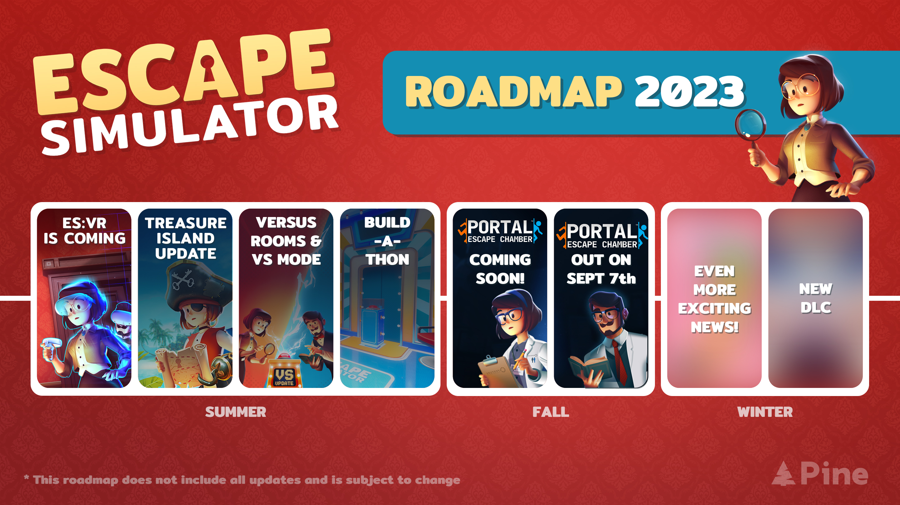

_Attention all Aperture personnel,_

The day has finally come for you to (re-)enter the highly esteemed Aperture Science Laboratories! We expect you all to achieve many great things within these chambers, which are of course packed to the brim with all the resources necessary for you to [strike]escape[/strike] do science stuff. Of course, any and all major scientific breakthroughs will be duly celebrated with some scrumptious [strike]lab rat treats[/strike] cake. Not a lie!

<iframe width="100%" height="500" src="https://www.youtube.com/embed/sfr0LCS67-U" title="Escape Simulator: Portal Escape Chamber - OUT NOW!" frameborder="0" allow="accelerometer; autoplay; clipboard-write; encrypted-media; gyroscope; picture-in-picture; web-share" allowfullscreen></iframe>

We are thrilled to announce that the wait is finally over, because the [Portal Escape Chamber DLC](https://store.steampowered.com/app/2000170/Escape_Simulator_Portal_Escape_Chamber/) (approved by Valve!) is **out now**! This means that anyone who already owns a copy of Escape Simulator can now add this free DLC to their library on the [official store page](https://store.steampowered.com/app/2000170/Escape_Simulator_Portal_Escape_Chamber/). Don't own a copy yet? You're in luck, because Escape Simulator is currently on the biggest sale ever with a 33% discount!

## Science isn't about WHY, it's about WHY NOT!

Picture this: a minor workplace mishap has led to a complete lockdown within the Aperture facility, and you and your fellow scientists find yourselves trapped within the labs. When life gives you lemons… you strap on your thinking caps, lace up those metaphorical puzzle-solving shoes, and dive into a maze of mind-bending puzzles. Safety protocols be damned!

Team up with up to nine other scientists to strategize, and put your ingenuity to the test as you navigate through meticulously crafted puzzles and intricately designed [strike]test chambers[/strike] lab rooms. Who knows, maybe you’ll even be rewarded with a flour-based confection for all your efforts!🎂

With the new Portal DLC out, we’re looking forward to our next major milestone, Escape Simulator VR! In this VR version, you will be able to play all the rooms from the base game as well as all the community-created rooms. So wishlist it now as it helps us greatly!

Of course we still have a lot of additional updates and much more exciting news planned for Escape Simulator, so we hope you'll continue to look forward to that! In the meantime, have a quick look at our updated roadmap for 2023. What could possibly be hiding behind those last two images? 👀

## So how are you holding up? 🥔

There’s a lot more exciting news on the way, so keep those portals primed, and those cubes cuddled, and be sure to keep in touch on our channels for more updates! Love the game and want to talk to other players and room builders? Then please consider joining our official [Discord](https://discord.gg/pinestudio) or [subreddit](https://www.reddit.com/r/PlayEscapeSimulator/)! In the meantime, we’d like to thank you all again for your unwavering support. We hope you enjoy this update as much as we do, and we cannot wait to hear what you think about it!