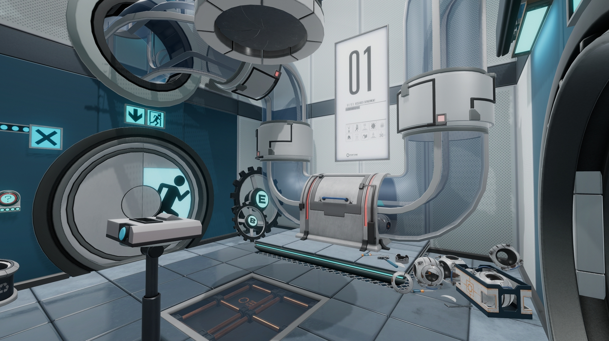

## Two years have truly flown by! 🥳

Can you believe it's already been two years already since Escape Simulator originally launched on Steam? After two years of consistent updates and many, many amazing contributions from our community builders, we are truly proud to see how far our little escape room game has come! We are also incredibly thankful to each and every one of you for sticking with us and for checking out every update we've added to the game since its initial launch. In this blog, we'll be looking back at the biggest accomplishments we've seen throughout the past twelve months, but first... let's look at a nice summary in the form of a neat infographic! 📊

As you can see, the past twelve months have been incredible for all of us at Pine Studio and we can't express enough how much we appreciate all of your support. Now that we've looked at some hard data, let's dive a little bit deeper into all of the changes and updates that have been made since the one-year anniversary of Escape Simulator!

## Ghosts, cowboys, artists, pirates, game show competitors AND scientists? What's next?! 🤯

It really has been a busy year, hasn't it? Ever since the one-year anniversary of Escape Simulator, we have added four free rooms, one free DLC and one paid DLC to the game! We kicked things off by releasing the  free spooky Graveyard room just before last year's Halloween. In December, we launched the rootin'-tootin' [Wild West DLC](https://store.steampowered.com/app/2175260/Escape_Simulator_Wild_West_DLC/). In March, we added the free room Leonardo's Workshop, in which you can explore the many secrets of the grandmaster of arts and inventions: Leonardo da Vinci. 

_Mamma mia! It's a ma-ma-masterpiece! 🎨_

Next up, we didn't just add a single room, but an entire island. Treasure Island was another free room updated that allows you to live out all of your swashbuckling fantasies! Another surprising location came in the form of the free Versus Room, which has two difficulty modes and takes place on a game show from the 80's. This was part of the Versus Update, which also included Versus Mode, a brand-new way to experience the game with your frenemies!

_Who's smarter? You or your friends? 🧠_

Last but certainly not least, we added the very first free DLC to Escape Simulator just last month. This cake had been in the oven for a while and we still can't believe it's not a lie! We're talking about the Portal Escape Chamber DLC, of course! It has been an incredible honour for us to work on this Portal-inspired room and we have tried to put as much of our love for this legendary game series into the room as possible. We would like to once again thank Valve for approving this amazing project and making this dream of ours come true. 🙌

_Have you already uncovered all of Aperture's secrets? 👨‍🔬_

In addition to all of the new content for escapists, we are still trying to add as many features and props to the in-game room editor. Some significant features that were added during the past twelve months include functional mirrors, in-game walkthroughs and the option to add flowing water! 🌊

Once again, the builders from our community proved their worth and showcased their creativity during the third and fourth editions of the Build-A-Room contest. The stakes were higher than ever with amazing prices like a trip to Paris, multiple Steam Decks, VR sets and even a cash prize of $2,000! Not everything turned out to be a competition however, as our community also proved that team work can lead to great accomplishments. One of our favourite initiatives from last year was the amazing community room The Collab: Museum!

Finally, we were beyond excited to reveal that the much requested VR version of Escape Simulator is officially in development. We can't wait to share more about this upcoming project and we hope you continue to look forward to it. In case you haven't already, be sure to add Escape Simulator VR to your wishlist!

https://store.steampowered.com/app/2440240/Escape_Simulator_VR/

## ...and there's still more where that came from! 👀

The fun won't stop, because we still have a lot more stuff planned for Escape Simulator! By now you might already be familiar with our roadmap for 2023, but just in case you haven't seen it already, let's have another look!

As you can see, we still have some surprises in store for you this year, but what happens after 2023? Well, we are delighted to tell you that plenty of new plans are already in the works for the upcoming year! We hope you'll continue to look forward to even more awesome content and in the meantime, we would like to thank all of you one final time for your continuous support. Please be sure to join us over on [Discord](https://discord.gg/pinestudio) and our [subreddit](https://www.reddit.com/r/PlayEscapeSimulator/) to talk to us and the awesome builders from our community.

### ♥ Pine team
