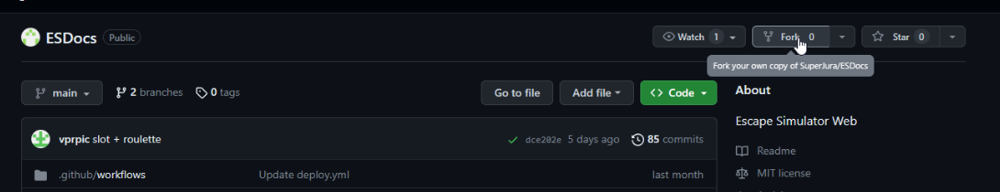
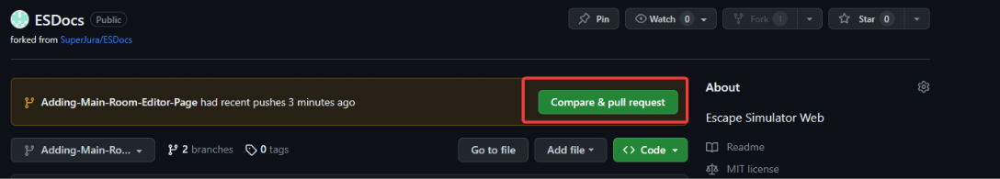
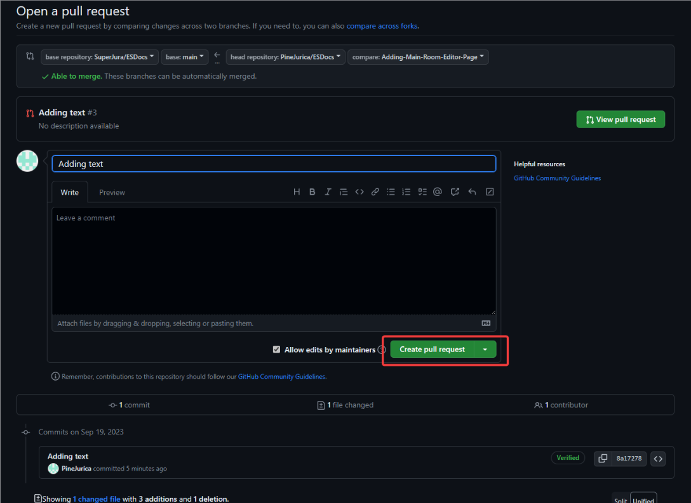

# Contributing

## Video tutorial
<iframe width="100%" height="500" src="https://www.youtube.com/embed/IzWp4ElVUvI" title="Contribute to Escape Simulator Documentation" frameborder="0" allow="accelerometer; autoplay; clipboard-write; encrypted-media; gyroscope; picture-in-picture; web-share" allowfullscreen></iframe>

## Text tutorial

### 1. login with your github account

### 2. Go to https://github.com/SuperJura/ESDocs

### 3. Click on Fork

### 4. Follow steps to create fork

### 5. On your fork, click on branches (initially it will say “Main”) and create a branch with a title that describes what you will do

### 6. Click Create branch

:::note

- You will have to create a branch every time you wish to add something. Branch can be viewed as a “chunk” you want to contribute.
- “Main” is the main branch you create other branches from.
- Before creating other branches in the future, click on “Sync Fork” on the main branch to get the latest updates from us.

:::

### 7. Change anything you wish on the pages

:::note

You can press Shift + . while on branch to run github’s own text editor

:::

### 8. Open any page and change it

### 9. Push the change to your fork

### 10. You now have a change on your fork. Time to submit it to our repo.
On the main page of your repo, click `Compare & pull request`

### 11. Click on “Create pull request”

### 12. **And that is it!** :tada:
Now it's our job to merge the changes in our repository.