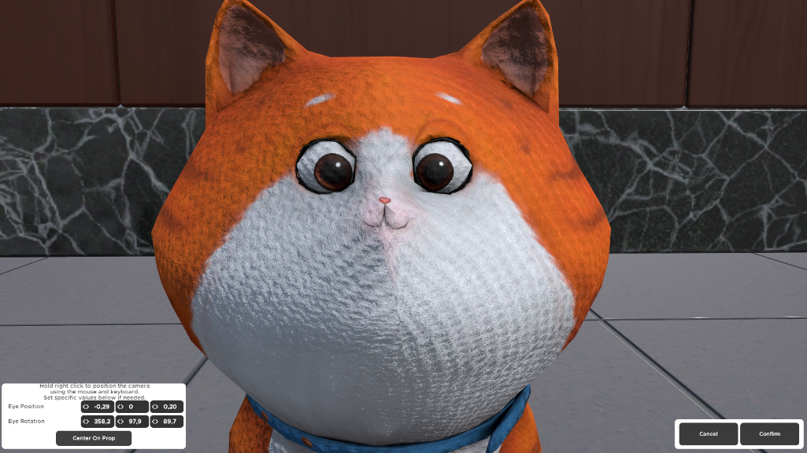

# Zoomable
Allows you to zoom in on a prop and all it's children.

:::tip
Certain lock props come with an already set up Zoomable behaviour (e.g. the victorian lock)!
:::

## Properties

### :small_orange_diamond:Edit Rotation

Set the camera position of the 'Zoomable' the players will have while they are using it.

Clicking the button will open the special zoomable settings screen where you can set the view you want to be visible when you use the Zoomable in the game.  

Here you can move the camera as you move it in the Room Editor (holding right click and using the WASDQE keys for movement) or you can set the position and rotation using the numbers in the bottom left corner.

The 'Center On Prop' button will help you position the prop and all it's children in the center of the screen. This positioning is based on the visible parts of the prop. Custom models with animations may have issues with this type of positioning, unless it has a non animating child.

:::note
Only the props that are set as children to the prop with the Zoomable behaviour will be visible in the Zoomable zoom itself. All other props and background will be blurred.
:::

## Common Uses

- Set the Zoomable on a lock (not the logic prop) or keypad prop so players can easily see the numbers/letters/symbols they are interracting with
- For notes or other hints that players shouldn't pick up, but you want them to be able to see more details
- For creating a microscope or telescope