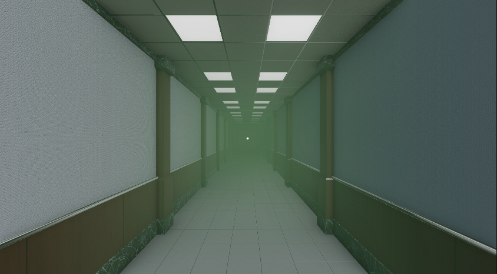
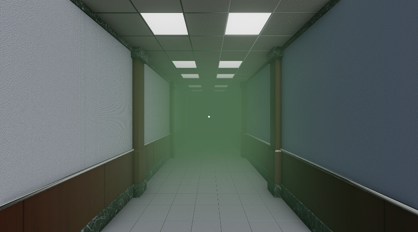

---

---

# Fog
Fog can help you change the mood of the level. It can be activated by other props with or without a transition animation. In order to deactivate it, another `Fog` (with 0 density) must be activated instead.

:::note
The `Fog` prop is not affected by the `Visibility Activator` prop, because the `Fog` prop is only a container for the settings. The actual visible fog is a sepparate object in the scene itself.
:::

:::tip
If you want to create a really dark room you can use the `Fog` prop in combination with the `Post Processing` prop to create really cool effects.
:::

## Properties

### :small_orange_diamond:Active On Start

When checked, the fog is activated as soon as the player starts the room. Only one fog can be activated on start.

### :small_orange_diamond:Color

The color value of the selected Fog.

### :small_orange_diamond:Mode 

Linear - increases density linearly from start to end distance.
Exponential - increases density exponentially based on distance.
ExponentialSquared - like Exponential but increases more.

Determines how thick the fog should be at what distance from the player.

`Linear` - increases the thickness of the fog linearly. In the example image below the `Start Distance` is set to 0, and the `End Distance` is set to 10.

`Exponential` - increases the thickness faster than `Linear` the further away you look. In the example image below the `Density` is set to 0.25.

`Exponential Squared` - increases the thickness faster than `Exponential` the further away you look. In the example image below the `Density` is set to 0.25.

### :small_orange_diamond:Start Distance

Determines how far away from the player does the fog start.

Set to 0 if you want the fog to start at the player.

:::note
This property is only visible if the `Linear` fog mode is set.
:::

### :small_orange_diamond:End Distance

Determines how far away from the player does the thickest part of the fog start.

If you want a slow and gradual shift of the fog set a high number. If you want a sudden increase set a lower number.

:::note
This property is only visible if the `Linear` fog mode is set.
:::

### :small_orange_diamond:Density

Fog thickness.

This sets a thickness variable that will be used in calculation for the `Exponential` and the `Exponential Squared` fog modes. The higher you set the value, the more fog you get.

:::note
This property is only visible if the `Exponential` or `Exponential Squared` fog modes are set.
:::

### :small_orange_diamond:Transition

Time in seconds it takes to transition from any active fog setting to this one.

When this `Fog` is triggered by another prop this `Fog` will take the current fog settings in the room and transition those values to the settings set in this `Fog`. 

In the example below, the fog is transitioning from a 0 `Density` `Exponential` fog, to a 0.5 `Density` `Exponential` fog and back. Both have the `Transition` set to 1. 

