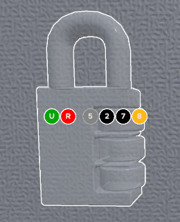
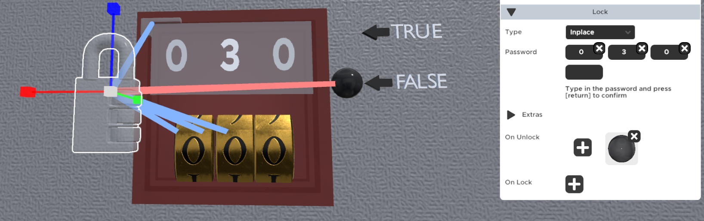
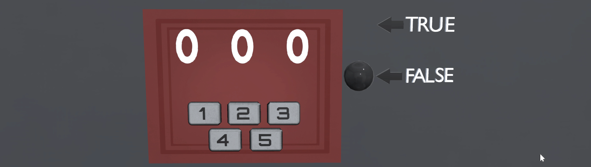
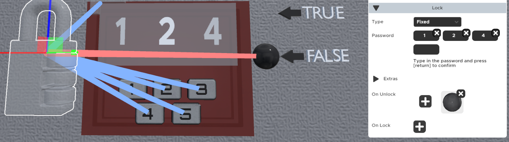
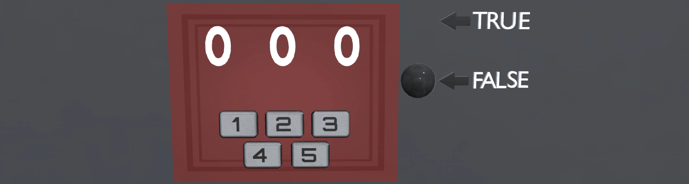
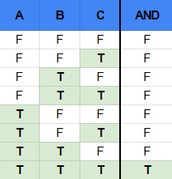
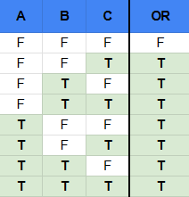
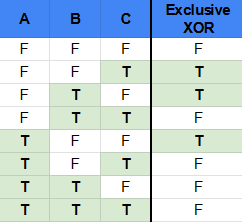
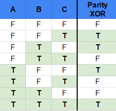
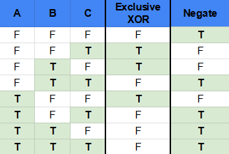

---

---

# Lock

Locks are a logic object that, when sent its configured password, will "unlock" and can send an output to another logic object or other objects with specific `Behavior` properties set. Locks are used to trigger events (opening chests, winning, animations, etc) when certain requirements are met.

Common Uses:

- Used to make a lock in game have actual functionality
- To trigger an animation when something specific happens
- To make a display show something
- To trigger the finish/victory screen

:::note
Remember that Dials and Turnables are able to give input that ranges from 0 to whatever you set, while Button, Slots, Triggers and other Locks only can send one specific number (Output Value) and 0.
:::

:::tip
The easiest way to see what a `Lock` has in the password field while testing the game is to use the `Display` logic prop.
:::

 
## Password Indexes
The lock object has multiple "indexes" to pass values to from zero up to the number of values your password contains. These appear when you are targetting the lock with another behaviour or logic prop (e.g. when setting the `On Complete` of a `Button` behaviour). They represent the password variables that you can change with a behaviour or logic prop while playing. 

In the image above is an example of a `Lock` prop with the password set to (5,2,7,8). The numbers shown in the image are the `Password` you set.

There are different colors for the indexes:
- If the index is colored _black_, you can target that index. Like the 2 and 7 in the image.
- If the index is colored _gray_, that means that index can't be targeted because it is already targeted by the targeting prop. Like the 5 in the image.
- If the index is colored _orange_, that means you are currently targeting it. Like the 8 in the image.

There are also two special indexes to the left of the password indexes. These are used for special operations:
- The green `U` is Unlock. Targeting this index will unlock the lock even though the password is not set correctly. This way you can for instance easily set up a button to pass certain puzzles easily while you're testing the game. (They can be accessed from Scripts by using the targeting index -500)
- The red `R` is Reset. Targeting this index will reset the lock's current values to 0. (They can be accessed from Scripts by using the targeting index -400)

:::tip
If you're using the `Continuous` or the `Fixed` lock you can target any index, but make sure you're only targeting one!
:::

## Properties

### :small_orange_diamond:Type

Inplace - Props targeting the lock only change the value at that position. 
Continuous - Uses any input from any lock, checking for a correct sequence. 
Fixed - Like Continuous, but resets the input values to 0 when it receives 'Password' amount of inputs.

For the examples bellow we will use a `Lock` with 3 lock values. And when it's unlocked it will trigger an `Animation` behaviour next to the `Display`.

#### Inplace
  Each input is assigned to a specific position of the password. An input will only change the position that it is targeting. This type of `Lock` will unlock when exactly the right numbers are in exactly the right position in the lock.

  Example:
  A turnable that is connected only to the second value. In play mode if you turn it to 2 and then to 3 the lock values will be 0,3,0.

:::note
This is the only `Lock` type that cares about the position of the inputs.
:::

#### Continuous
  Any input that is sent to the lock, no matter where it comes from or what position it is sent to, changes the value next in line. When the last value is entered it will loop back to the beginning. Use this lock type when it only matters that a combination is entered in the correct order, but the position of the numbers doesn't matter.

  The continuous lock starts checking the solution only after there have been the same amount of inputs as there are password numbers, and then checks for every next number inputted.
  
  Example:
  If a lock password is 1,2,4 it will return true when you input something like 3,5,1,2,4. The `Display` will only show the last 3 inputted numbers (1,2,4) but not in that order. It will display it as 2,4,1. Because every inputted number will loop around once it reaches the end.

  So here the 2 has written over the 3, and the 4 has written over the 5. And when the `Lock` checks the password it knows the 1 was first, and followed by 2 and 4, so that is the correct password.

:::tip
`Continuous` locks are mostly used for detecting a correct order of e.g. button presses. And for that you will most likely need to use custom output values if you're using buttons, slots, or other similar inputs.
:::

#### Fixed (_Similar to Continuous_)
  Any input that is sent to the lock, no matter where it comes from or what position it is sent to, changes the value next in line. When the last value is entered it will loop back to the beginning. Each time the first value is entered, the remaining values are set to 0. Use this lock type when you want to make sure that values are entered in the correct order, __but do not want previous attempts to impact it__.

  This type of `Lock` only checks the password once you enter the same amount of inputs as there are password values.

  Same example as `Continuous`:
  If a lock password is 1,2,4 it will output false when you input something like 3,5,1,2,4. After you input the number 2 all other values are changed to 0, so the `Display` will show 2,4,0, and since you have not inputted the last value the lock will not check the password and will wait for the final value.

  To have the correct password you must input the correct password at the correct position, e.g. 3,5,1,1,2,4.

:::tip
`Fixed` locks are mostly used for detecting a correct order of e.g. button presses. And for that you will most likely need to use custom output values if you're using buttons, slots, or other similar inputs.
:::

### :small_orange_diamond:Password

The password values that need to be inputted to unlock this lock. Target them with behaviours (e.g. 'Button', 'Animation').

Locks need a password, which can consist of one input or several more. To create a new password digit, fill out the empty box. A new empty box for the next digit will appear, you can leave that empty if you don't want to make the password longer.

  Example:
  If you wanted a lock to open to 3 number `Turnable`s with the password "1 - 2 - 3" for unlock, you need to enter in the first box "1", in the second box "2" and the third "3". You would then link each `Turnable` to the lock position it is supposed to refer to (if you are using the Inplace type of lock, which you should for a regular number lock).

### :small_orange_diamond:Output Value

Number that will be sent to the targeted props on correct completion.

The numerical value the lock sends out to another lock when it gets unlocked.

:::note
Locks cannot have an output of 0.
:::

### :small_orange_diamond:Logic Type

AND - All password values must be inputted correctly. 
OR - One or more of the password values must be correct. 
Parity XOR - There must be an odd number of correct values. 
Exclusive XOR - There must be only one correct value.

This determines how the lock handles input. Intended for more complex logical operation, mostly used with the `Inplace` lock type.

:::tip
For most locks, you want to use AND. The other modes are intended for setting up complex logic instead of just entering in a password.
:::

Each value in the lock can at any moment be considered as true or false, by comparing the password value with the actual inputted value at that position (for `Inplace`), e.g. a password of (1,2,3) with the input of (2,2,2) will for the purposes of the logic operations be read as (false, true, false) results.
These true/false results and the `Logic Type` operation used will determine if the `Lock` should be locked or unlocked. In the tables below A, B and C represent the results from the three different password indexes and their result in their respective logical operation.

For example, let's have 3 `Turnable`s each connected to a different index on an `Inplace` lock with a password of (1,2,3):

#### AND
For the AND operation to return _true_, all inputs need to be _true_.

This means that for the `Inplace` lock every value inputted needs to match the position and the number, e.g. for the (1,2,3) password, the only _true_ return from the AND operation is if the results are (true, true, true), which is only the case for the inputted numbers (1,2,3).

#### OR
For the OR operation to return _true_, one or more of the inputs need to be _true_.

This means that for the `Inplace` lock at least one of the values inputted need to match the position and the number, e.g. for the (1,2,3) password, one of the 7 possible _true_ returns from the OR operation is if the results are (false, true, false), which is the case for the inputted numbers (-,2,-).

#### Exclusive XOR
For the Exclusive XOR to return _true_, only one of all of the inputs is _true_.

This means that for the `Inplace` lock only one of the values inputted need to match the position and the number, e.g. for the (1,2,3) password, one of the 3 possible _true_ returns from the OR operation is if the results are (false, true, false), which is the case for the inputted numbers (-,2,-).

__Difference between OR and Exclusive XOR__: OR is more permissive, returns _true_ for any _true_ result, including multiple _true_ results, e.g. OR will return true if the results are (true, true, false). Exclusive XOR returns true only for one _true_ result.

__Difference between Exclusive XOR and Parity XOR__: Parity XOR is more permissive, returns true for an odd number of _true_ results, while Exclusive XOR will only return true if one result is _true_

#### Parity XOR
For the Parity XOR to return _true_, an odd number of all of the inputs needs to be _true_.

This means that for the `Inplace` lock an odd number of the values inputted need to match the position and the number, e.g. for the (1,2,3) password, one of the 4 possible _true_ returns from the OR operation is if the results are (false, true, false) which is the case for the inputted numbers (-,2,-). Mostly used for more complicated logic gates.

__Difference between OR and Parity XOR__: OR is more permissive, returns _true_ for any _true_ result, including an even number of _true_ results, e.g. OR will return true if the results are (true, true, false). Parity XOR returns true only for an odd number of _true_ results.

__Difference between Exclusive XOR and Parity XOR:__ Parity XOR is more permissive, returns true for any odd number of _true_ results, while Exclusive XOR will only return true if one result is _true_

### :small_orange_diamond:Negate

When checked, the logic will be reversed. Any password that is not correct will unlock the lock, and every correct password will lock the lock.

`Negate` takes the final result from the `Logic Type` operation and inverts it, _true_ becomes _false_ and _false_ becomes _true_. This is used for logic gate setups.

### :small_orange_diamond:Disable On Unlock

When checked, the lock is disabled after it is unlocked once, ignoring any further inputs.

This box determines if a lock is reusable or no longer can be interacted with once the password conditions were met for the first time.

:::tip
Locks that get relocked will turn their status to "0" and send a "passive" 0 to connected locks. That means it will change the input on the connected lock but not cause the lock to check if the password conditions are met
:::

### :small_orange_diamond:Exit Zoom On Unlock

When checked this lock triggers an exit from a parent 'Zoomable' when unlocked, if a player is at that moment zoomed in on the 'Zoomable' parent.

If you want to be able to force the player out of the zoom on a `Zoomable` you can set this `Lock` as a child of the `Zoomable`. Once the player is zooming in on that `Zoomable` and the `Lock` is unlocked, the player will be forced out of the zoom.

### :small_orange_diamond:Check Password Delay

Amount of time the lock waits to check the password after receiving the last input.

Can be set to determine how much time has to pass before the lock checks if the input numbers match the set password.

This is commonly used for prevent people from button mashing and getting the correct input. If the player actually solved the puzzle and thinks they have the correct solution, they will usually wait for a short while before continuing. This is especially evident for `Turnable` locks where the player just clicks on the `Turnable`s trying to brute force them.

:::tip
If you don't want to add a delay to the check but want to discourage brute forcing a puzzle, you can try adding a lever or a button that the player has to press every time they input the password so that the password is checked only when that button is pressed. Check out the Keypad prop to see how to set that up.
:::

:::note
There is a bug that causes the `Lock` to ignore the `Check Password Delay` when the value comes from a `Trigger` logic prop.
:::

### :small_orange_diamond:On Unlock

The targeted props will be triggered once the current 'Lock' password values match the 'Lock' password.
If 'Check Password Delay' is set the check being delayed will also delay the 'On Unlock' targeting.

If the password conditions are met, things that you add here will get activated by the lock. The targets can be behaviours (like `Animation`s or `Button`s) and logic props (like the `Finish` prop, or other `Lock`s).

### :small_orange_diamond:On Lock

The targeted props will be triggered once the current 'Lock' password values no longer match the 'Lock' password and the 'Lock' was previosly unlocked.
If 'Check Password Delay' is set the check being delayed will also delay the 'On Lock' targeting.

If the password conditions are no longer met, things that are added here will get activated. The targets can be behaviours (like `Animation`s or `Button`s) and logic props (like the `Finish` prop, or other `Lock`s).

:::note
`On Lock` cannot be uset to send a 1/0 value to another lock, to circumvent that you can target an Animation that targets the other lock.
:::
