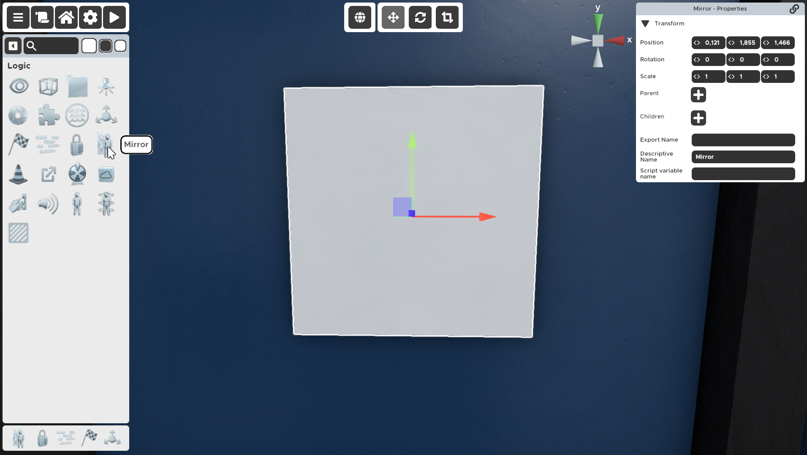

---

---

# Mirror

A mirror can be placed like a one-sided plane and will reflect everything visible in the room, just as you would expect a normal mirror to do.
It can be scaled to any size, and works in any direction (e.g. on the floor/ceiling), but there are some limitations.

## Limitations
- Performance will degrade quickly if you have too many mirrors or if your mirrors are too large in scale. Try to stick with one regular-scale mirror per room and disable any mirrors outside the player's field of vision.
- Mirror reflections become very pixelated when viewed up close.
- A mirror does not reflect the reflection of other mirrors.
- A mirror does not reflect water at the moment (known bug, should be fixed later).

## Helpful Tips

- You can paint on a mirror, but that will make it non-opaque. If you need a semi-transparent layer to add design, place a transparent in front of the mirror instead.
- Using mirrors in dark rooms is not very effective, they work best in well-lit rooms.
- Using a light source to illuminate a mirror can make the reflection and contrast clearer, but will also make it shinier, especially the surface structure. The lighting should be indirect and the light source out of the mirror's reflection range. Try placing a point light well above the mirror, pointing down.

---

a **very** vintage mirror made with a transparent overlay
