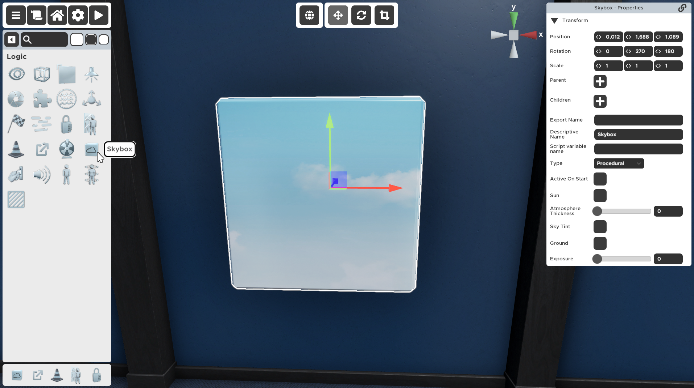

---

---

# Skybox

The Logic prop that changes the sky around the room. You can add your own images or use the procedurally generated sky by setting the colors yourself. You can also change the skybox during gameplay by triggering another skybox at a later time. Only one skybox can be activated at a time. Triggering another skybox will hide the previous skybox.

## Properties

### :small_orange_diamond:Type

Procedural - Generated skybox based on colors. 
6 Sided - Created based on textures.

Use your own images or just color the sky by setting the color values.

- `Procedural` - Creates a horizon line that separates the sky and ground, allowing you to choose the colors yourself.
- `6 Sided` - If you want to have a bit more control over the look of the skybox you can use your own images.

### :small_orange_diamond:Active On Start

When checked, this skybox is activated as soon as the player starts the room. Only one skybox can be activated on start.

Skyboxes can be triggered like some other props to be activated at a certain time. This checkmark determines whether this skybox should be activated when the room starts. 

When checked, this skybox will be active when the player starts the room.

When not checked, this skybox will only be active after it has been triggered by another prop.

:::note
You can turn off the preview of the `Active On Start` skybox in the room settings in the upper left corner of the Room Editor.
:::

### :small_orange_diamond:Sun

When checked, the skybox will be generated with a sun.

The sun is just a visual element of the skybox. It does not add any additional lighting to the room itself, you have to use the light prop for that.

When checked, the sun will be generated on top of the sky

When not checked, the sun will not be shown.

### :small_orange_diamond:Atmosphere Thickness

The density of the atmosphere. An atmosphere of higher density absorbs more light.

Setting a higher number will make the atmosphere hazier and more opaque.

### :small_orange_diamond:Sky Tint

The color tint that is applied to the procedural sky.

Here you can change the color of the top half of the skybox.

### :small_orange_diamond:Ground

The color that is applied to the procedural ground.

Here you can change the color of the bottom half of the skybox.

### :small_orange_diamond:Exposure

Adjusts the sky’s exposure. This allows you to change tonal values in the skybox this Material generates. Larger values produce a more exposed, seemingly brighter, skybox. Smaller values produce a less exposed, seemingly darker, skybox.

### :small_orange_diamond:Presets

A selection of textures to choose from.

This is a list of preset skybox textures you can freely use to quickly change the look of the skybox.

If you want to customize your skybox with custom images, change the individual images in the bottom section.

### :small_orange_diamond:Tint Color

The color tint that is applied over the custom images.

You can tint the current skybox with a color you want, whether you're using custom images or the presets.

:::note
The default value is gray.
:::

### :small_orange_diamond:Rotation

Used to rotate the images of the custom skybox.

Here you can set rotate the skybox. You can also do that by editing the images themselves.

### :small_orange_diamond:Front/Back/Left/Right/Up/Down

The custom images of the skybox.

Here you can change the preset images and create your own skybox using custom images.
