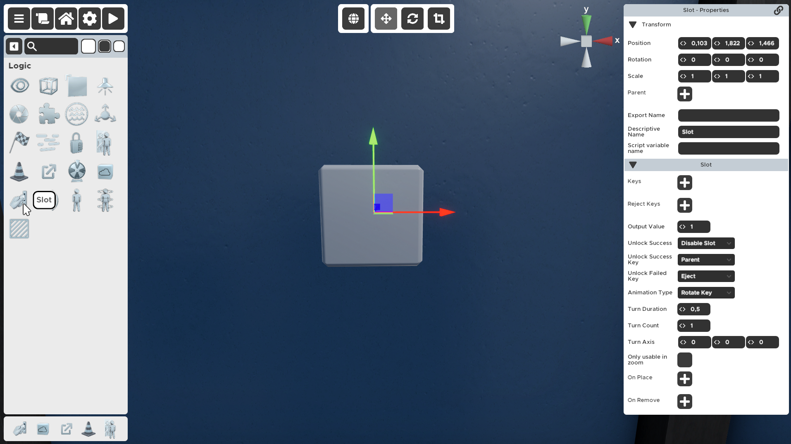

---

---

# Slot

An object that represents a "keyhole". Any defined "key" can unlock it.

Slots get triggered if you place the correct item in them. It can only be occupied by one item at a time.

You can determine the area that will accept the keys by changing the position and scale of the Slot prop. All of the area covered by the Slot white cube can be used by the player to place an item in the slot. 

:::tip
If you're making a door that a player must unlock with a key remember to parent the Slot object to the door, so the key and slot animate with the opening door. Some prop doors already come equipped with a properly set up slot and key (e.g. Victorian door).
:::

:::tip
Some items can fall into slots if placed or dropped above them, others will fall through slots. To make items fall into slots that normally wouldn't you can give them a slotable parent and hide that inside the actual object. It will lend its slotableness to the child.
:::

## Properties

### :small_orange_diamond:Keys

A list of props that the player can place in the slot and are considered correct. When a player places one of the 'Key' props in the selected 'Slot' the slot will first do the success animation and after that trigger the 'On Place' targets with the 'Output Value'. After completing that the slot does the 'Unlock Success' behaviours.

Here you add each item that will be accepted as the correct key for this slot. Everything can be a key, not just actual key shaped items. Just make sure to not accidentally make your keys static.

:::tip
Animated items cannot be assigned as keys. Assign them to be keys first, then animate them. This way the key properties will carry over and be retained when it becomes a pickable animation.
:::

### :small_orange_diamond:Reject Keys

	A list of props that the player can place in the slot and are considered not correct. When a player places one of the 'Reject Key' props in the selected 'Slot' the slot will first do the failed animation and after that trigger the 'On Remove' targets with the 'Output Value'. After completing that the slot does the 'Unlock Failed' behaviour.

Items you add here will be accepted into the slot, but they will not trigger the slot to give out the Output Value signal. When a slot rejects an incorrect key the slot will send a 0 value to whatever it is connected to

### :small_orange_diamond:Edit Key Placement

Set the position and rotation of the 'Key' and 'Reject Key' of the key in the 'Slot'.

Clicking this button will open a special mode where you will be able to preview and edit the position and rotation of the slot key when placed in the slot. 

### :small_orange_diamond:Output Value

Number that will be sent to the targeted props on correct completion.

This is the number that will be sent to the lock after the player has placed one of the correct Keys into the slot.

### :small_orange_diamond:Unlock Success

Disable Slot - the slot will no longer be usable after one correct Key is placed.
Keep Slot Active - the slot is always usable.

Determines if the slot stays usable after being activated once.

### :small_orange_diamond:Unlock Success Key

Parent - the key is parented to the slot, but can be removed. 
Eject - ejects the key from the slot into the player inventory.
Merge - the key becomes a static part of the slot.

Decides what happens with the correct key after it activated the slot:

- `Merge` means that it will become a static part of the slot, you can not pick it up anymore.
- `Parent` means that the key will stay in the slot and move with it, but it can be picked up again.
- `Eject` will put the key right back into the player inventory after the activation process/animation.

:::tip
If you have several single use keys in your room, it is advisable to simply merge them to the slot after success to avoid inventory clutter or confusion.
:::

### :small_orange_diamond:Unlock Failed Key

Parent - the key is parented to the slot, but can be removed. 
Eject - ejects the key from the slot into the player inventory.
Merge - the key becomes a static part of the slot.

The same as with success key. 

:::tip
Make sure to not accidentally make false keys merge, else it will prevent the slot from accepting the correct key.
:::

### :small_orange_diamond:Animation Type

Rotate Key - rotates the key when placed. 
None - no animation.

Here you can decide if you want your item to spin like a key, or to do nothing like a properly placed statue or book. Turn Duration and Turn Count determine the turning animation further. You can also make the turn be less than one! This can create lever-like effects sometimes or other interesting stuff. I use less-than-one turn effects in combination with further animation, so that for example a writing pen has a more complex animation consisting of two different movements.

### :small_orange_diamond:Turn Duration

Determines how long to turn the inserted key before executing the end actions.

The turn time in seconds for each turn of the Rotate Key animation. For example, if the Turn count is set to 2 and the Turn duration is set to 2.5, when the correct key is placed in the slot it will make 2 full turns that each lasts for 2.5 seconds. Meaning the animation will end after 5 seconds.

Reject keys will only finish about half of the animation and then return back to the starting position.

:::note
Only visible when the Animation type is not set to None
:::

:::note
The Turn Axis also influences the duration and rotation amount of the key. If you're having issues timing them try setting only one of the axis to exactly 1.
:::

### :small_orange_diamond:Turn Count

Determines the amount of turns the inserted key will do in the Turn Duration time given.

How many 360 turns should the key make when rotating.

:::note
Only visible when the Animation type is not set to None
:::

### :small_orange_diamond:Turn Axis

Set the axis around which the turn animation will rotate around. If all the values are set to zero the key item will not rotate.

Will determine how your key turns. Make sure to test this! Because the default axis makes some of the actual key assets spin sideways!

:::note
Only visible when the Animation type is not set to None
:::

### :small_orange_diamond:Only Usable In Zoom

This interaction cannot be activated by the player from outside the zoom. To be used in a 'Zoomable' this prop needs to be a child of the 'Zoomable'.

If checked, this slot can only be activated by the player if the player is zoomed in on the parent, whether that is a pickable object or a prop with the Zoomable behaviour.

If not checked, the player can place items in this slot while not in zoom mode (while walking around the room).

:::note
If you check this make sure the slot is a child of the pickable/zoomable.
:::

### :small_orange_diamond:On Place

Triggered when a 'Key' prop is placed or removed. When a 'Key' prop is removed all targeted 'On Place' locks are sent a 0.

If the correct key is placed in the slot, the slot will activate/send the Output Value to the items you link here.

If the reject key is removed from the slot, the slot will activate/send a 0 to the items you link here.

:::tip
If the slot is not activating as soon as you place an item but you're not using an Animation try setting the Turn duration/count to 0.
:::

### :small_orange_diamond:On Remove

Triggered when a 'Reject Key' prop is placed or removed. When a 'Reject Key' prop is removed all targeted 'On Remove' locks are sent a 0.

If a key or a Reject key is removed from the slot, the slot will activate/send the Output Value to the items you link here.
