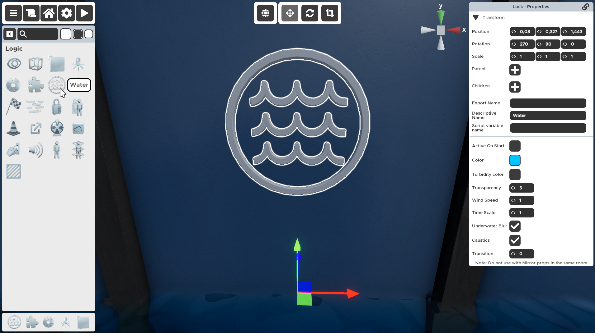

---

---

# Water
An animated water feature that covers the entire level.

:::note
Only one Water prop can be active at a time.
:::

:::tip
You can adjust water level by moving the prop up or down.
:::

## Properties
### :small_orange_diamond:Active On Start

	When checked, the water is activated as soon as the player starts the room. Only one water can be activated on start.

If not checked the Water prop will not be visible when starting the game and needs to be activated with a Visibility Activator.

If checked, the Water prop will be actived right before the player gains control of the character, at the end of the loading screen.

:::note
If this is checked the water will be visible in the Room Editor even while the prop is not selected. This is a setting you can change in the Room Settings screen.
:::

### :small_orange_diamond:Color

	What color to tint the water with.

### :small_orange_diamond:Turbidity Color

	The color of particles in the water.

There is a certain amount of particles in the water, what color should they be?

### :small_orange_diamond:Transparency

	How transparent should the water be. Visibility of items under the water.

Determines how much color to put in the water.

### :small_orange_diamond:Wind Speed

	How tall should the waves be.

### :small_orange_diamond:Time Scale

	How fast to animate the water. Default is 1.

You can slow down or speed up the movement of the water to get amazing effects. Try making the waves big and then setting Time Scale to a number smaller than 1.

### :small_orange_diamond:Underwater Blur

	Whether to blur the camera when it goes under the water.

If you have a room that is completely underwater you probably don't want the camera to be blurry, right?

:::note
Disabled in the Room Editor while you're working on other things, but enabled when playtesting.
:::

### :small_orange_diamond:Caustics

	Whether to show underwater light shimmer from the water surface.

:::note
Disabled in the Room Editor while you're working on other things, but enabled when playtesting.
:::

### :small_orange_diamond:Transition

	Time in seconds it takes to transition from one Water setting to this one.

When this Water prop is activated the game will take into consideration the current water settings in the room and transition from that one to the settings written in this Water prop.
